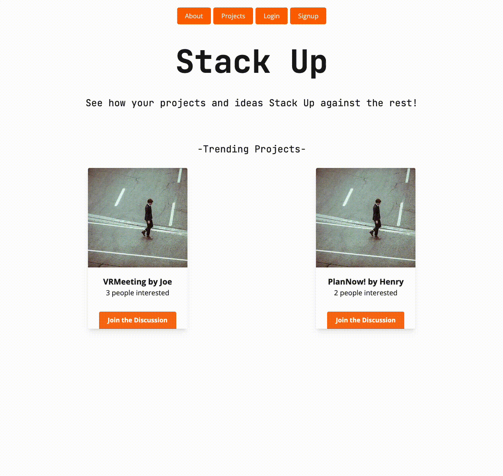

# Stack Up | [Deployed](https://stackupapp.netlify.app)
*NOTE: Heroku, the apps backend host, is currently having issues connecting with Github. Full site functionality will return: TBD*

## Description
 Are you a developer with an innovative idea, looking for honest feedback? Is your business looking to invest in the next big thing? Head on over to Stack Up where we invite passionate developers to flex their talents by posting their projects to receive real feedback from other community members. At Stack Up, we provide an environment where people can get excited about new concepts, network with like-minded individuals, and see how your projects and ideas stack up against the rest!
 
 

## Table of Contents
- [Installation](#installation)
- [Usage](#usage)
- [Contributing](#contributing)
- [Tests](#tests)
- [Questions](#questions)
## Installation
Deployment Date (TBD)
## Usage
 Deployment Date (TBD)
## Contributing
 If you have suggestions or ideas for future development, let us know! Our contact information can be found below.
## Tests
 N/A
## Questions
If you have any questions about the project or repository, open an issue or contact us directly at <code>shaun.tehranchi@gmail.com, seankennethcruz@gmail.com, sharonjyoon@gmail.com, hyewonpark26@gmail.com</code>. Find more of our projects @ <code>ST12345678910, skcruzer, sharonjyoon, hyep2</code>
 
